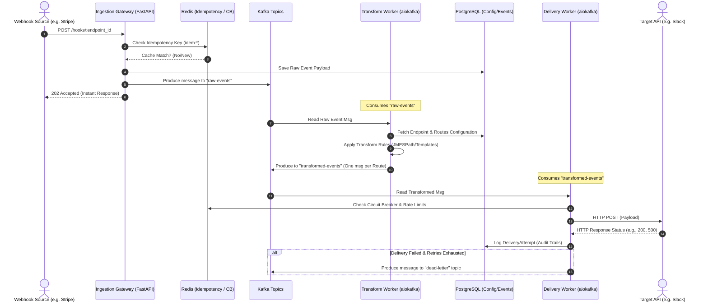

# ⚡ Webhook Relay & Transformation Service

[](https://fastapi.tiangolo.com)
[](https://react.dev)
[](https://kafka.apache.org)
[](https://redis.io)
[](https://www.postgresql.org)
[](https://www.docker.com)

A self-hostable, high-performance, and fully decoupled **Webhook Relay & Transformation Service**. It receives incoming webhooks, validates signatures, deduplicates payloads, transforms data per route, and reliably delivers to multiple destinations with circuit breaking, rate limiting, and backoff retries.

*“Zapier for webhooks — self-hosted, event-driven, built for reliability, with zero vendor lock-in.”*

---

## 📐 System Architecture

The service uses a fully decoupled, asynchronous, event-driven architecture powered by **Apache Kafka** (running in KRaft mode, no ZooKeeper needed) to isolate ingestion from heavy delivery tasks.

### E2E Message Flow



---

## 🚀 Key Features

*   **Decoupled High-Throughput Ingestion**: Validates signature headers, verifies idempotency via Redis, logs to PostgreSQL, publishes to Kafka, and returns `202 Accepted` immediately (P99 ingestion latency `< 50ms`).
*   **Idempotency & Security**: Built-in HMAC-SHA256 signature verification and Redis-backed request deduplication (prevents duplicate delivery).
*   **Route Fan-Out & Pipeline Transformations**: One webhook endpoint can forward payloads to multiple destination routes. Each route can specify:
    *   **JMESPath expressions** to select, filter, or restructure payloads.
    *   **Template replacement** (e.g., `{{data.amount / 100}}`) for basic math, unit conversions, and custom formatting.
*   **Resilient Delivery Engine**:
    *   **Circuit Breaker**: Trips on consecutive failures, pausing requests to a failing destination.
    *   **Rate Limiter**: Sliding window algorithm to respect downstream API rate limits.
    *   **Exponential Backoff**: Jittered exponential retries (e.g., 1s, 2s, 4s, 8s...) to avoid hammering destinations.
    *   **Concurrency Control**: Global and per-worker task limiting (default: `asyncio.Semaphore(50)`) to prevent resource exhaustion.
*   **Dead Letter Queue (DLQ) & Replay**: Events that exhaust all retries are published to the `dead-letter` topic. Rest APIs allow manual replay of any event back through the ingestion gateway.
*   **Observability Dashboard**: Premium React single-page app displaying real-time metrics charts, searchable event histories, delivery status timelines, route configurators, and replay actions.

---

## 📁 Repository Structure

```
├── app/                     # FastAPI Backend Application
│   ├── api/                 # Endpoints for endpoints, routes, events, and manual replays
│   ├── core/                # Database, Redis, Kafka connections & config setups
│   ├── delivery/            # Core delivery worker execution, rate-limiters, circuit breakers
│   ├── gateway/             # Ingestion router for receiving webhooks
│   ├── models/              # SQLAlchemy database ORM models
│   ├── schemas/             # Pydantic schemas for request validation & serialization
│   └── transform/           # Pipeline transformation engine (JMESPath/Templates)
├── dashboard/               # Frontend React Single-Page Application (Vite/TypeScript)
│   ├── src/                 # App interface, Tailwind designs, components, and CSS rules
│   └── Dockerfile           # Multi-stage build configuration for the dashboard
├── workers/                 # Standalone Persistent Kafka Consumer Processes
│   ├── transform_worker.py  # Consumes raw-events, resolves routes, transforms, and republishes
│   └── delivery_worker.py   # Consumes transformed-events, makes HTTP calls, applies CB/Retry/DLQ
├── docker-compose.yml       # Composes App, Workers, DB, Redis, and Kafka services
├── requirements.txt         # Python package dependencies
├── pyproject.toml           # Project packaging and metadata configuration
└── test_webhook.py          # Local simulation script for end-to-end integration testing
```

---

## 🛠️ Tech Stack

### Backend
*   **Framework**: [FastAPI](https://fastapi.tiangolo.com/) (Python 3.12/3.14)
*   **Database ORM**: [SQLAlchemy 2.0](https://www.sqlalchemy.org/) + [SQLAlchemy-Utils](https://sqlalchemy-utils.readthedocs.io/)
*   **Database Driver**: [asyncpg](https://github.com/MagicStack/asyncpg) (Asynchronous PostgreSQL)
*   **Message Broker Client**: [aiokafka](https://github.com/aio-libs/aiokafka) (Asynchronous Kafka producer/consumer)
*   **HTTP Client**: [httpx](https://www.python-httpx.org/) (Asynchronous HTTP)
*   **Cache & Deduplication**: [redis-py](https://github.com/redis/redis-py) (Async Redis integration)

### Frontend
*   **Framework**: React (TypeScript) + [Vite](https://vitejs.dev/)
*   **Styling**: [Tailwind CSS](https://tailwindcss.com/)
*   **Icons**: [Lucide React](https://lucide.dev/)
*   **HTTP Client**: Axios

---

## ⚙️ Environment Variables (`.env`)

Configuration is managed via environment variables. See [`.env.example`](file:///.env.example) for defaults:

| Name | Default Value | Description |
|---|---|---|
| `RELAY_DATABASE_URL` | `postgresql+asyncpg://...` | PostgreSQL connection string |
| `RELAY_REDIS_URL` | `redis://redis:6379/0` | Redis database connection string |
| `RELAY_DEBUG` | `true` | Enables/disables debug mode |
| `RELAY_RATE_LIMIT_RPM` | `60` | Default rate limit (Requests Per Minute) per route |
| `RELAY_MAX_DELIVERY_ATTEMPTS` | `5` | Maximum delivery retries |
| `RELAY_RETRY_BACKOFF_MS` | `1000` | Base delay for backoff retries (milliseconds) |
| `RELAY_DELIVERY_TIMEOUT_MS` | `10000` | Timeout for HTTP delivery calls (milliseconds) |
| `RELAY_CIRCUIT_BREAKER_THRESHOLD` | `10` | Delivery failures before tripping circuit breaker |
| `RELAY_CIRCUIT_BREAKER_COOLDOWN_S` | `30` | Time in seconds to wait in open state before retrying |
| `RELAY_IDEMPOTENCY_TTL_S` | `86400` | Time-to-live for idempotency keys in Redis |
| `RELAY_KAFKA_BOOTSTRAP_SERVERS` | `kafka:9092` | Kafka broker servers list |
| `RELAY_KAFKA_TOPIC_RAW_EVENTS` | `raw-events` | Target topic for raw incoming webhooks |
| `RELAY_KAFKA_TOPIC_TRANSFORMED_EVENTS` | `transformed-events` | Target topic for transformed outgoing webhooks |
| `RELAY_KAFKA_TOPIC_DEAD_LETTER` | `dead-letter` | Target topic for permanently failed deliveries |

---

## ⚡ Getting Started (Docker Compose)

The easiest way to spin up the entire infrastructure is using **Docker Compose**:

### 1. Clone & Setup
```bash
# Clone the repository
git clone https://github.com/<username>/webhook-relay-service.git
cd webhook-relay-service

# Create environmental file from example
cp .env.example .env
```

### 2. Boot Services
Run the following command to start PostgreSQL, Redis, Kafka, the FastAPI Backend, the React Dashboard, the Transform Worker, and the Delivery Worker:
```bash
docker compose up --build
```

Once up, access the interfaces:
*   **Web Dashboard**: `http://localhost:5173`
*   **FastAPI backend**: `http://localhost:8000`
*   **FastAPI API Swagger Docs**: `http://localhost:8000/docs`

---

## 🧪 Running End-to-End Simulation Tests

To demonstrate the full pipeline, you can run a local test script that mimics a real webhook provider (like Stripe).

1. Open the **Web Dashboard** at `http://localhost:5173`.
2. Locate or create an active endpoint, and write down its `Endpoint ID` and `HMAC Secret`.
3. Open [`test_webhook.py`](file:///home/soumabrata/Workspace/Experiments/webhook-relay-service/test_webhook.py) and update the configuration variables at the top of the file:
   ```python
   ENDPOINT_ID = "<YOUR_ENDPOINT_ID>"
   SECRET = b"<YOUR_HMAC_SECRET>"
   ```
4. Run the script from your terminal:
   ```bash
   python test_webhook.py
   ```
5. **Expected Output**:
   * The script will calculate the correct HMAC-SHA256 signature, attach the required headers, and POST the request to `http://localhost:8000/hooks/{endpoint_id}`.
   * You'll receive a `202 Accepted` response status from the gateway immediately.
   * The event will be processed by the Transform Worker, relayed by the Delivery Worker, and logged in the PostgreSQL DB.
   * Watch the event appear in real-time in the **Web Dashboard** under the **Events** log.

---

## 📊 Current Implementation Status & Roadmap

The project is structured in phases. Below is the progress status of the core deliverables:

### 🟢 Completed Features (Phase 1 & 2)
*   [x] **Asynchronous Webhook Ingestion**: Gateway immediately offloads events to Kafka.
*   [x] **Signature Verification**: Secure HMAC-SHA256 verification filters fake payloads.
*   [x] **Idempotency Deduplication**: Redis caching prevents duplicate processing within a 24h window.
*   [x] **Pipeline Transformations**: Step-by-step filters using JMESPath queries and string interpolation templates.
*   [x] **Decoupled Workers**: Autonomous `transform-worker` and `delivery-worker` consuming Kafka partitions independently.
*   [x] **Robust Delivery Policies**: Circuit breaker throttling, exponential backoff with random jitter, and sliding window rate limits.
*   [x] **Interactive Dashboard**: Modern UI showing event status, full execution timelines, detail logs, and manual replay buttons.
*   [x] **Single-Command Setup**: Completed Docker Compose infrastructure stack.

### 🟡 In Progress & Future Roadmap (Phase 3)
*   [ ] **Sandboxed JavaScript Transformations**: Moving from templates to secure, sandboxed V8/JavaScript scripts, allowing users to write custom JS scripts for complex payload transformation rules.
*   [ ] **DLQ Management Dashboard UI**: Adding a dedicated dashboard view for the dead-letter topic events, enabling batch replays, custom payload modifications before replaying, and discarding entries.
*   [ ] **Multi-Tenant User Management & RBAC**: Introducing user accounts (JWT-based OAuth2 auth), workspaces, role-based access controls, and administrative APIs to securely manage endpoints/routes.
*   [ ] **Prometheus Metrics & Alerts**: Exposing `/metrics` to track ingestion volume, delivery latency percentiles, worker queue depths, and configuring Slack/Email alerts when failure spikes occur.
*   [ ] **Dynamic Route Filtering**: Enabling rules-based routing where events are only sent to specific destinations if the payload contents match a set of predefined conditions (e.g., `event_type == 'payment.succeeded'`).
